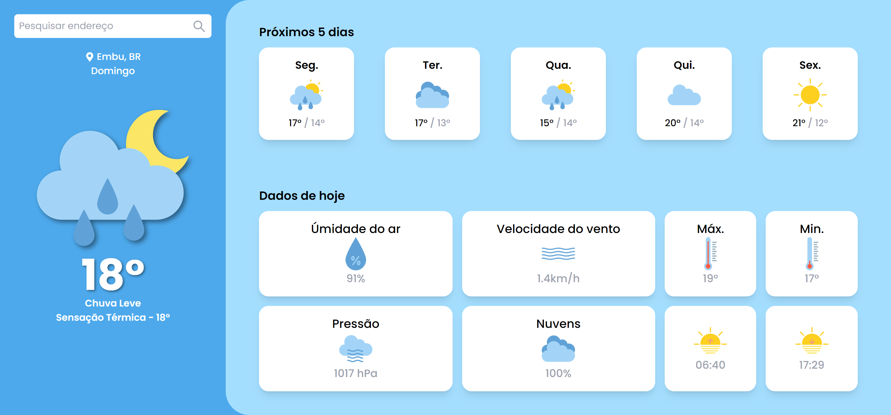

# Dashboard Clima



Essa dashboard é um projeto em React que utiliza a biblioteca TailwindCSS para estilização e consome dados da OpenWeatherAPI para exibir informações sobre o clima na cidade pesquisada.

## 🔗 Acesso ao Site

Você pode acessar o projeto hospedado no Netlify através deste link:
https://dashboardclima-jose.netlify.app/

## 🚀 Instalação

Para instalar o projeto, siga os seguintes passos:

1. Clone o repositório:
   ```
   git clone https://github.com/Eujosee/Dashboard-Clima.git
   ```
2. Acesse a pasta do projeto:
   ```
   cd Dashboard-Clima
   ```
3. Instale as dependências:
   ```
   npm install ou npm i
   ```
4. Inicie o servidor:
   ```
   npm run dev
   ```
5. Acesse o projeto no link informado

## 💡 Utilização

Ao acessar o projeto, você terá a opção de permitir o acesso do navegador à sua localização atual para que seja feita automaticamente a pesquisa dos dados do clima para essa localização. Caso prefira, você também pode optar por pesquisar manualmente o clima de uma cidade específica.

## 🛠️ Tecnologias Utilizadas

- [React](https://react.dev/learn)
- [TailwindCSS](https://tailwindcss.com/docs/installation)
- [OpenWeatherAPI](https://openweathermap.org/api)
- [Axios](https://axios-http.com/ptbr/docs/intro)
- [React Icons](https://react-icons.github.io/react-icons/)
- [Toastify](https://fkhadra.github.io/react-toastify/introduction)

## ⚠️ Avisos

- A geolocalização do navegador pode não ser tão precisa.


## 🙏 Créditos

Ícones por iconixar:
https://www.flaticon.com/packs/weather-161

## 📝 Licença

Este projeto está sob a licença MIT. Consulte o arquivo [LICENSE](LICENSE) para mais detalhes.
